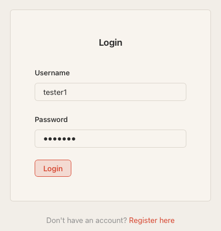
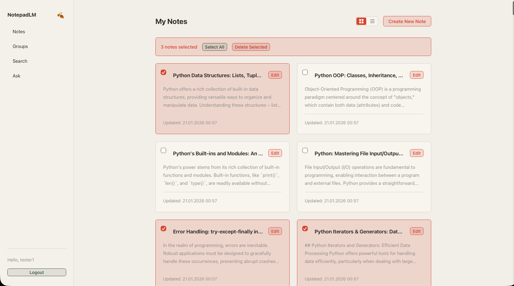
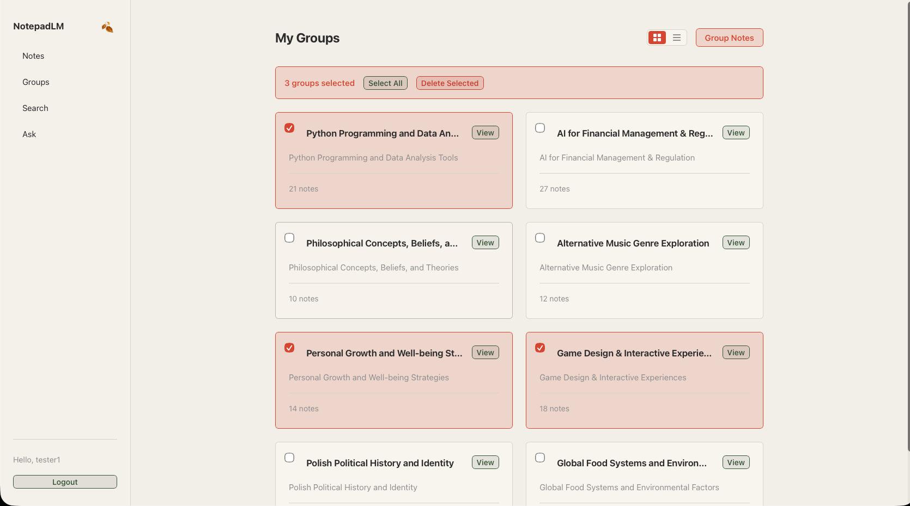
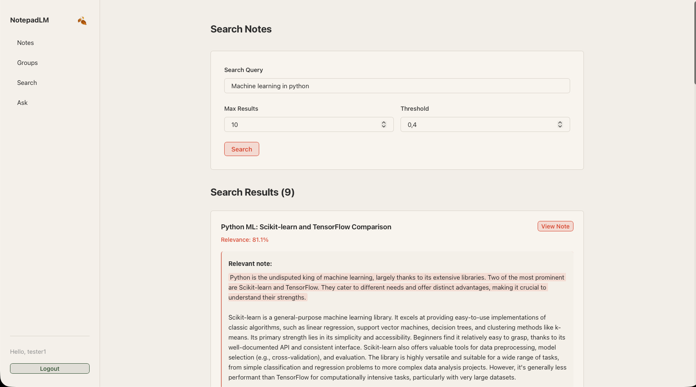
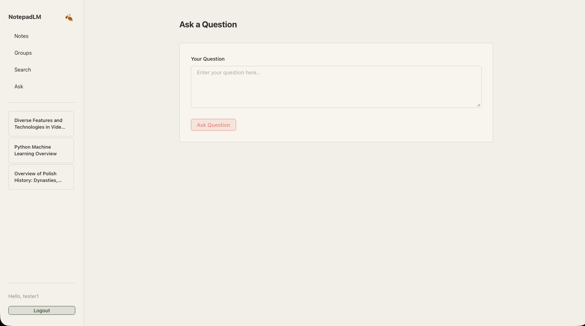
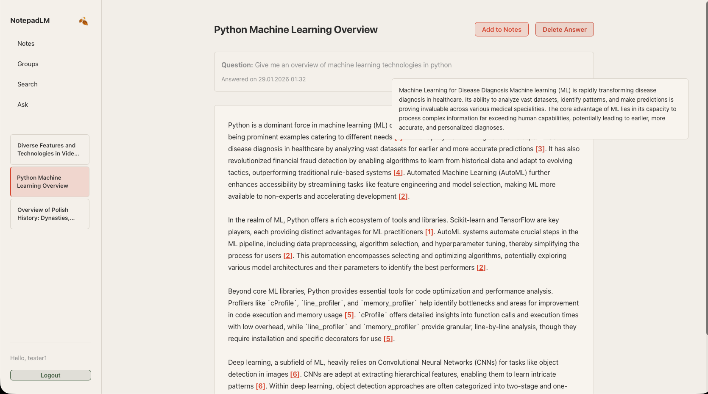

# NotepadLM

**NotepadLM** is a web-based note management system enhanced with semantic search and large language model (LLM) support.
The application allows users to create, organize, search, and query notes using natural language, leveraging vector databases and an external LLM (Google Gemini).

---

## Features

* User authentication (registration, login, logout)
* CRUD operations on notes
* Automatic semantic grouping of notes
* Semantic search with configurable parameters
* Question answering over user notes with citations
* Frontend built with Vite
* Backend powered by FastAPI

---

## System Requirements

### Backend

* Python **3.12**
* **PDM** (Python Dependency Manager)
* Google Gemini API key

  > A free API key can be generated via Google AI Studio, subject to usage limits.

### Frontend

* Node.js **25.2.1**
* npm (Node Package Manager)

---

## Installation

### Clone the Repository

```bash
git clone https://github.com/marcin-banak/NotepadLM.git
cd NotepadLM
```

---

### Backend Installation

1. Navigate to the project root directory:

   ```bash
   cd /path/to/NotepadLM
   ```

2. Install dependencies:

   ```bash
   pdm install
   ```

3. Configure environment variables in the virtual environment activation file:

   ```bash
   export GOOGLE_API_KEY="your-api-key"
   ```

---

### Frontend Installation

1. Navigate to the frontend directory:

   ```bash
   cd src/frontend
   ```

2. Install dependencies:

   ```bash
   npm install
   ```

---

## Running the Application

The system can be started automatically using the provided script:

```bash
./run.sh
```

Alternatively, you can run the backend and frontend manually.

---

### Backend

Start the FastAPI server:

```bash
uvicorn app.app:app --host 0.0.0.0 --port 8000 --reload --app-dir src
```

API documentation is available at:

```
http://localhost:8000/docs
```

---

### Frontend

From the `src/frontend` directory, run:

```bash
npm run dev
```

Then open the displayed address in your web browser.

---

## User Authentication



### Registration

Users can register by selecting **“Register here”** on the login screen and providing a username and password.
After successful registration, the user is automatically logged in.

### Login

Users log in by entering valid credentials and clicking **Login**.
Invalid credentials result in an error message.

### Logout

The **Logout** option is available in the top-right corner of the application.
Logging out removes the JWT token from the browser and ends the session.

---

## Notes Management



* **Create notes** via the *New Note* option
* **View and edit notes** from the notes list
* **Delete notes** using *Delete Selected*
* Deleted notes are removed from both the database and the vector store

---

## Semantic Groups



* Notes can be automatically clustered into **semantic groups**
* Groups are generated and named automatically
* Deleting a group does **not** delete the notes it contains
* Notes removed from a group remain available in the system

---

## Semantic Search



The **Search** view enables semantic note retrieval based on meaning rather than keywords.

### Parameters

* **Max Results** – maximum number of returned notes
* **Threshold** – minimum semantic similarity score

Matching fragments are highlighted, and clicking a result opens the full note.

---

## Question Answering (Ask)



Users can ask natural-language questions over their notes using the **Ask** view.

* Relevant note fragments are retrieved automatically
* Answers are generated using an LLM
* Each answer includes **citations** pointing to source notes
* Citations are interactive and link directly to original notes
* Answers can be saved as notes via **Add To Notes**
* Question and answer history is preserved

### Generated Answer Example



---

## User Scenario (Demo Data)

A sample user scenario is provided in the `user_scenario` directory:

* `note_set.json` – example notes
* `upload_notes.py` – upload script

### Upload Example Notes

After creating a user account, run the following command from the project root:

```bash
pdm run python -m user_scenario.upload_notes \
<username> <password> note_set.json
```

This will populate the system with sample notes for demonstration purposes.